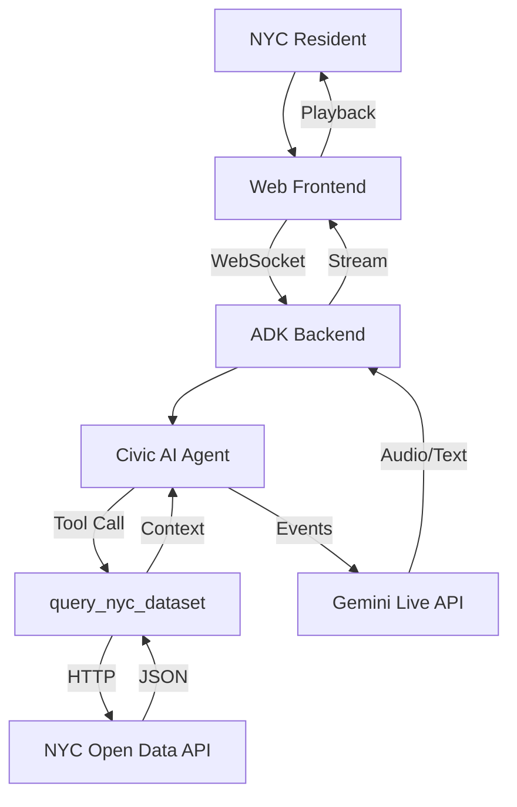
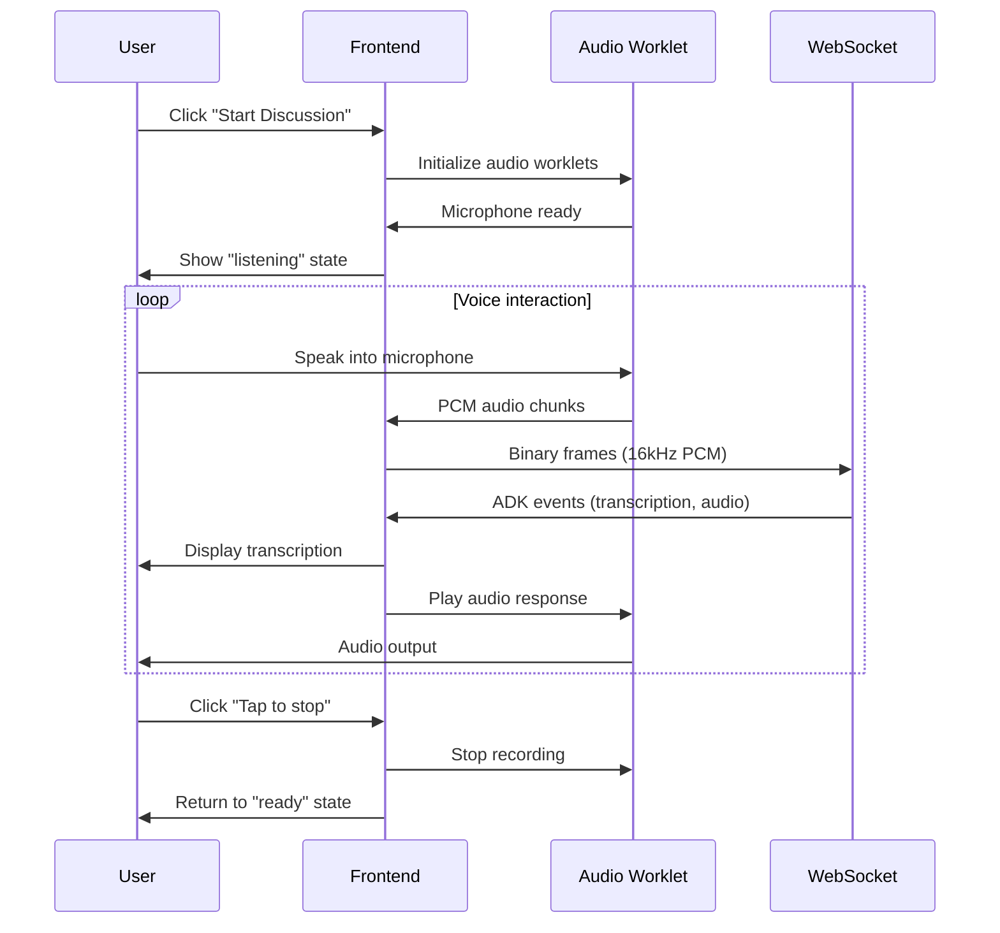
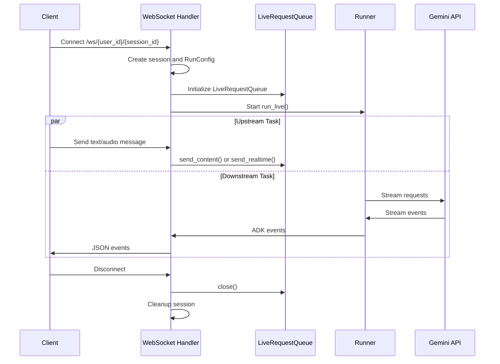
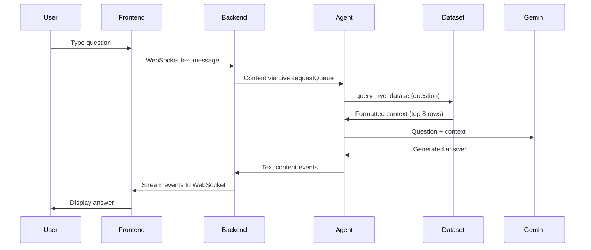
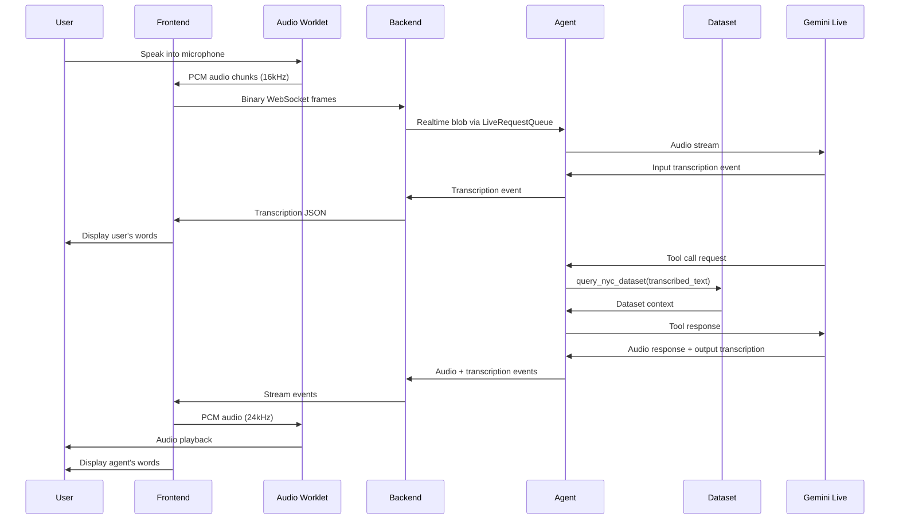

# Architecture Documentation

## Table of Contents

- [System Overview](#system-overview)
- [High-Level Architecture](#high-level-architecture)
- [Components](#components)
  - [Frontend Layer](#frontend-layer)
  - [Backend Layer](#backend-layer)
  - [Agent Layer](#agent-layer)
  - [NYC Dataset Tool](#nyc-dataset-tool)
- [Data Flow](#data-flow)
  - [Text Request Flow](#text-request-flow)
  - [Voice Request Flow](#voice-request-flow)
- [Audio Pipeline](#audio-pipeline)
  - [Recording Pipeline](#recording-pipeline)
  - [Playback Pipeline](#playback-pipeline)
- [ADK Event Types](#adk-event-types)
- [Session Management](#session-management)
- [Configuration Options](#configuration-options)
- [Error Handling](#error-handling)
- [Performance Considerations](#performance-considerations)
- [Security Considerations](#security-considerations)
- [Future Enhancements](#future-enhancements)

## System Overview

Algorithm Explained is a multimodal civic AI agent that combines Google's ADK (Agent Development Kit) with NYC Open Data to help residents understand government algorithms through natural conversation.

**Core Technologies:**
- Frontend: Vanilla JavaScript + Web Audio API
- Backend: FastAPI + Google ADK
- AI: Gemini Live API with native audio
- Data: NYC Open Data Socrata API

See [Development Guide](DEVELOPMENT.md) for implementation details.

## High-Level Architecture



## Components

### Frontend Layer

**Technology**: Vanilla JavaScript with Web Audio API

**Key Files**:
- `index.html` - Main UI with text/voice mode toggle
- `app.js` - WebSocket client and event handler
- `audio-recorder.js` - Microphone capture with PCM encoding
- `audio-player.js` - Real-time audio playback
- `pcm-recorder-processor.js` - Audio worklet for recording
- `pcm-player-processor.js` - Audio worklet for playback

See [Usage Guide](USAGE.md) for user-facing features.

**Responsibilities**:
- Render chat interface with user/bot message bubbles
- Capture text input or microphone audio
- Encode audio to 16kHz 16-bit PCM format
- Stream data via WebSocket to backend
- Receive ADK events and update UI accordingly
- Play back audio responses at 24kHz

**User Flow**:


### Backend Layer

**Technology**: FastAPI + Google ADK

**Key Files**:
- `main.py` - FastAPI application with WebSocket endpoint
- `civic_agent/agent.py` - ADK agent definition and NYC dataset tool

See [API Reference](API.md) for WebSocket protocol details.

**ADK Components**:
- `Agent`: Configured with NYC dataset tool and civic instructions
- `Runner`: Executes agent with session management
- `SessionService`: In-memory session storage with resumption
- `LiveRequestQueue`: Thread-safe queue for streaming messages

**WebSocket Lifecycle**:



**Responsibilities**:
- Accept WebSocket connections with user/session IDs
- Configure ADK RunConfig with appropriate modalities
- Launch concurrent upstream and downstream async tasks
- Route messages between client and `LiveRequestQueue`
- Serialize ADK events to JSON and send to client
- Handle graceful disconnection and cleanup

### Agent Layer

**Configuration**:
- **Model**: `gemini-2.5-flash-native-audio-preview-12-2025` (native audio)
- **Tools**: `query_nyc_dataset` (custom NYC data retrieval tool)
- **Instructions**: Civic-focused, accessible, factual

**Agent Behavior**:
- Always queries dataset before answering
- Cites specific agencies, tools, and purposes
- Explains technical concepts in plain language
- Admits when dataset doesn't contain relevant information
- Maintains empathetic, supportive tone

### NYC Dataset Tool

**Function**: `query_nyc_dataset(question: str) -> str`

See [Dataset Documentation](DATASET.md) for complete implementation details.

**Process**:
1. Fetch up to 200 rows from NYC Open Data API endpoint
2. Extract keywords from user question (remove stopwords)
3. Score each row by keyword overlap in all fields
4. Apply domain-specific boosts (NYPD +3, police +2, housing +2, etc.)
5. Return top 8 matches with formatted context

**Data Structure**:
Each row contains:
- `agency_name`: NYC agency (e.g., "New York City Police Department")
- `tool_name`: Name of the algorithmic tool
- `tool_description`: What the tool does
- `tool_purpose`: Why it's used
- Additional compliance and impact fields

**Retrieval Example**:
```
Question: "Does the NYPD use facial recognition?"
Keywords: ["nypd", "facial", "recognition"]
Scoring: Each row scored by keyword matches
Boost: "nypd" matches get +3 score
Result: Top 8 NYPD-related tools returned
```

## Data Flow

### Text Request Flow



### Voice Request Flow



## Audio Pipeline

### Recording Pipeline

```
Microphone
    ↓
MediaStream (browser native sample rate)
    ↓
AudioContext (16kHz resample)
    ↓
AudioWorkletNode (pcm-recorder-processor)
    ↓
Float32Array audio samples
    ↓
Convert to Int16 PCM
    ↓
ArrayBuffer
    ↓
WebSocket binary frame
    ↓
Backend (bytes)
    ↓
types.Blob(mime_type="audio/pcm;rate=16000", data=audio_data)
    ↓
LiveRequestQueue.send_realtime()
    ↓
Gemini Live API
```

### Playback Pipeline

```
Gemini Live API
    ↓
ADK Event with inlineData
    ↓
Base64-encoded PCM data
    ↓
Backend serialization
    ↓
WebSocket JSON message
    ↓
Frontend base64 decode
    ↓
ArrayBuffer (Int16 PCM)
    ↓
AudioWorkletNode (pcm-player-processor)
    ↓
Float32Array conversion
    ↓
Ring buffer (180 second capacity)
    ↓
AudioContext destination
    ↓
Speaker output
```

## ADK Event Types

The application handles these key ADK event types:

### Input Transcription Events
```json
{
  "inputTranscription": {
    "text": "Does the NYPD use facial recognition",
    "finished": false
  }
}
```

Displays user's spoken words in real-time as they speak.

### Content Events (Text)
```json
{
  "content": {
    "parts": [
      {"text": "Based on the NYC compliance data..."}
    ]
  },
  "partial": true
}
```

Agent's text response, streamed incrementally.

### Content Events (Audio)
```json
{
  "content": {
    "parts": [
      {
        "inlineData": {
          "mimeType": "audio/pcm;rate=24000",
          "data": "base64_encoded_audio..."
        }
      }
    ]
  }
}
```

Agent's audio response, streamed in chunks.

### Output Transcription Events
```json
{
  "outputTranscription": {
    "text": "Based on the NYC compliance data",
    "finished": false
  }
}
```

Transcription of agent's spoken words.

### Turn Complete Events
```json
{
  "turnComplete": true
}
```

Signals end of agent's response, resets UI state.

## Session Management

- **Session Creation**: First connection creates session with given user_id and session_id
- **Session Resumption**: Reconnecting with same IDs resumes conversation history
- **In-Memory Storage**: Sessions stored in memory (cleared on server restart)
- **Multi-User Support**: Each user_id gets independent conversation state

## Configuration Options

### Response Modality

Automatically detected based on model:
- Native audio models (`*native-audio*`): AUDIO modality with transcription
- Half-cascade models: TEXT modality for better performance

### Proactivity (Native Audio Only)

When enabled, the model can:
- Proactively respond without explicit prompts
- Interject naturally in conversation
- Ask clarifying questions

### Affective Dialog (Native Audio Only)

When enabled, the model can:
- Detect emotional cues in user's voice
- Adapt tone and response style accordingly
- Provide more empathetic responses

## Error Handling

### Frontend Errors
- **Microphone access denied**: Shows clear message, fallback to text mode
- **WebSocket disconnection**: Auto-reconnect after 5 seconds
- **Audio worklet failure**: Graceful degradation to text mode

### Backend Errors
- **Dataset API failure**: Returns error message to agent, agent explains limitation
- **Session not found**: Creates new session automatically
- **Invalid audio format**: Logs error, continues processing other events

## Performance Considerations

### Audio Latency
- **Target**: <500ms end-to-end latency for voice responses
- **Recording buffer**: 128 samples (~8ms at 16kHz)
- **Playback buffer**: 180 seconds ring buffer for smooth playback
- **Network**: WebSocket binary frames minimize overhead

See [Development Guide](DEVELOPMENT.md#performance-optimization) for optimization strategies.

### Dataset Retrieval
- **Fetch limit**: 200 rows per request (balance between coverage and speed)
- **Matching**: Simple keyword overlap (fast, no ML inference)
- **Return limit**: Top 8 matches (enough context without overwhelming)
- **Cache**: Consider adding Redis cache for repeated queries

See [Dataset Documentation](DATASET.md#performance-characteristics) for benchmarks.

### Scalability
- **Session storage**: Currently in-memory (single instance)
- **WebSocket**: One connection per active user
- **Gemini API**: Rate limits depend on API tier
- **Upgrade path**: Redis for sessions, load balancer for horizontal scaling

See [Development Guide](DEVELOPMENT.md#deployment) for production deployment.

## Security Considerations

### API Keys
- Store `GOOGLE_API_KEY` in `.env` file (not committed)
- Use environment variables for all secrets
- Consider Vertex AI with service accounts for production

See [Setup Guide](SETUP.md#get-google-api-key) for key management.

### WebSocket
- Current implementation allows all origins (CORS wildcard)
- Production: Restrict to specific domains
- Consider authentication/authorization for user sessions

See [API Reference](API.md#authentication) for future auth patterns.

### Dataset Access
- Public NYC Open Data API (no authentication required)
- Rate limits enforced by Socrata platform
- Consider caching to reduce external requests

See [Dataset Documentation](DATASET.md#api-rate-limits) for rate limit details.

## Future Enhancements

### Technical
- [ ] Add Redis for distributed session storage
- [ ] Implement vector similarity search for better retrieval
- [ ] Add caching layer for dataset queries
- [ ] Support multiple datasets beyond algorithmic tools
- [ ] Add analytics and usage tracking

### Features
- [ ] Visual algorithm explanations with diagrams
- [ ] Document upload (e.g., upload notice to understand)
- [ ] Multi-turn clarification dialogs
- [ ] Export conversation transcripts
- [ ] Mobile app with native audio
- [ ] Spanish language support

### Agent Capabilities
- [ ] Deep-link to source documents
- [ ] Explain algorithmic bias and fairness
- [ ] Compare similar tools across agencies
- [ ] Track algorithm changes over time
- [ ] Connect to legal resources and advocacy groups
