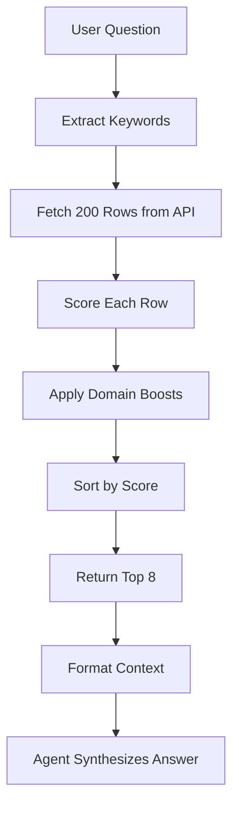

# NYC Dataset Tool

## Overview

The NYC dataset tool queries the official NYC Algorithmic Tools Compliance Report to provide factual, evidence-based answers about government algorithms. This tool is the primary data source for the civic AI agent.

## Data Source

**Dataset**: [NYC Algorithmic Tools Compliance Report](https://data.cityofnewyork.us/City-Government/Algorithmic-Tools-Compliance-Report/jaw4-yuem)

**API Endpoint**: `https://data.cityofnewyork.us/resource/jaw4-yuem.json`

**Platform**: Socrata Open Data API

### What It Contains

Official compliance reports from NYC agencies documenting:
- Algorithmic tools in use
- Agency names and departments
- Tool names and descriptions
- Tool purposes and use cases
- Impact assessments
- Compliance status

### Update Frequency

Dataset updated as agencies file compliance reports (typically quarterly).

## Tool Implementation

### Function Signature

```python
async def query_nyc_dataset(question: str) -> str:
    """Query the NYC Algorithmic Tools Compliance Report dataset.
    
    Args:
        question: Natural language question about NYC government algorithms
        
    Returns:
        Formatted context from the dataset with relevant rows
    """
```

The function returns formatted text that the agent uses to synthesize answers.

### Process Flow



### Implementation Steps

**1. Fetch Dataset Rows**

```python
async def fetch_dataset_rows(limit: int = 50) -> list[dict]:
    params = {"$limit": min(max(limit, 1), 1000)}
    
    async with httpx.AsyncClient(timeout=20.0) as http:
        resp = await http.get(DATASET_URL, params=params)
        resp.raise_for_status()
        data = resp.json()
    
    return data if isinstance(data, list) else []
```

Fetches up to 200 rows by default (configurable).

**2. Extract Keywords**

```python
keywords = [
    word.strip(".,!?():;\"'").lower()
    for word in question.split()
]
keywords = [word for word in keywords if len(word) > 1 and word not in stopwords]
```

Removes:
- Punctuation
- Stopwords (the, a, is, are, etc.)
- Single-character words

**3. Score Each Row**

```python
for row in rows:
    haystack = " ".join(str(v) for v in row.values()).lower()
    score = sum(1 for kw in keywords if kw in haystack)
```

Each keyword match in any field adds 1 to score.

**4. Apply Domain Boosts**

```python
if "nypd" in keywords and "nypd" in haystack:
    score += 3
if "police" in keywords and "police" in haystack:
    score += 2
if "housing" in keywords and "housing" in haystack:
    score += 2
if "education" in keywords and "education" in haystack:
    score += 2
```

Domain-specific keywords get extra weight:
- `nypd`: +3
- `police`, `housing`, `education`: +2
- `tool`, `algorithm`, `ai`: +1

**5. Sort and Return Top Matches**

```python
scored.sort(key=lambda x: x[0], reverse=True)
return [row for _, row in scored[:max_rows]]
```

Returns top 8 rows by score.

## Data Structure

### Dataset Row Schema

Each row contains:

```json
{
  "agency_name": "New York City Police Department",
  "tool_name": "Domain Awareness System",
  "tool_description": "Real-time crime analysis platform...",
  "tool_purpose": "Enhance situational awareness and...",
  "tool_status": "In Use",
  "date_updated": "2024-03-15",
  // ... additional compliance fields
}
```

### Formatted Output

Tool returns formatted context:

```
Found 3 relevant entries from NYC Algorithmic Tools Compliance Report:

1. New York City Police Department - Domain Awareness System
   Description: Real-time crime analysis platform
   Purpose: Enhance situational awareness and resource deployment

2. New York City Police Department - Facial Recognition System
   Description: Identifies suspects from video footage
   Purpose: Criminal investigations

3. New York City Police Department - ShotSpotter
   Description: Acoustic gunshot detection system
   Purpose: Rapid response to gun violence
```

## Retrieval Algorithm

### Keyword Extraction

**Question**: "Does the NYPD use facial recognition?"

**Extracted keywords**: `["nypd", "use", "facial", "recognition"]`

**After stopword removal**: `["nypd", "facial", "recognition"]`

### Scoring Example

**Row 1**: NYPD Facial Recognition System
- Keywords matched: `nypd` (1), `facial` (1), `recognition` (1) = 3
- Domain boost: `nypd` = +3
- **Total score: 6**

**Row 2**: Department of Education - Student Assessment Tool
- Keywords matched: none = 0
- **Total score: 0** (filtered out)

**Row 3**: NYPD Domain Awareness System
- Keywords matched: `nypd` (1) = 1
- Domain boost: `nypd` = +3
- **Total score: 4**

**Result**: Row 1 (score 6) ranks above Row 3 (score 4)

### Performance Characteristics

- **Time complexity**: O(n × m) where n = rows, m = keywords
- **Fetch time**: ~500ms for 200 rows
- **Scoring time**: ~50ms for 200 rows
- **Total latency**: ~600ms

Fast enough for real-time voice interaction.

## Limitations

### Current Approach

**Strengths:**
- Fast (no ML inference)
- Simple and debuggable
- Works well for exact keyword matches
- No external dependencies

**Weaknesses:**
- No semantic understanding
- Misses synonyms (e.g., "cops" vs. "police")
- Can't handle complex queries
- No relevance learning

### Future Improvements

**Semantic Search:**
- Use vector embeddings (OpenAI, Vertex AI)
- Store embeddings in vector database
- Similarity search instead of keyword matching

**Hybrid Approach:**
- Keyword filter + semantic reranking
- Best of both: speed and accuracy

**Query Expansion:**
- Expand keywords with synonyms
- Use LLM to rephrase query
- Multiple retrieval strategies

## Configuration

### Environment Variables

```bash
# Dataset URL (optional)
DATASET_URL=https://data.cityofnewyork.us/resource/jaw4-yuem.json
```

### Retrieval Parameters

Modify in `backend/civic_agent/agent.py`:

```python
# Fetch limit
rows = await fetch_dataset_rows(limit=200)  # Default: 200

# Return limit
matched_rows = filter_rows_for_question(rows, question, max_rows=8)  # Default: 8
```

### Custom Boosts

Add agency-specific boosts:

```python
if "sanitation" in keywords and "sanitation" in haystack:
    score += 2
if "transportation" in keywords and "transportation" in haystack:
    score += 2
```

## Testing

### Test Dataset Query

```python
import asyncio
from civic_agent.agent import query_nyc_dataset

async def test():
    result = await query_nyc_dataset("What tools does the NYPD use?")
    print(result)

asyncio.run(test())
```

### Test Retrieval Quality

```bash
# Run from backend directory
uv run python -c "
import asyncio
from civic_agent.agent import query_nyc_dataset

async def test():
    questions = [
        'Does NYPD use facial recognition?',
        'What housing algorithms exist?',
        'Tell me about education tools'
    ]
    for q in questions:
        print(f'\nQ: {q}')
        result = await query_nyc_dataset(q)
        print(result[:200] + '...')

asyncio.run(test())
"
```

## Data Quality

### Accuracy

Responses are only as good as the dataset:
- Based on agency self-reporting
- May lag behind actual tool deployment
- Descriptions vary in detail across agencies

### Coverage

Dataset includes major NYC agencies:
- NYPD (New York City Police Department)
- HPD (Housing Preservation and Development)
- DOE (Department of Education)
- HRA (Human Resources Administration)
- ACS (Administration for Children's Services)
- And more...

### Gaps

Not all agencies or tools may be represented:
- New tools not yet reported
- Federal or state systems not included
- Private contractor tools may be omitted

## API Rate Limits

### Socrata Platform

NYC Open Data uses Socrata:
- **Without app token**: 1,000 requests/hour
- **With app token**: 10,000 requests/hour

### Current Implementation

No rate limiting on our side. For production:

```python
# Add Redis rate limiter
from redis import Redis
from time import time

cache = Redis()

async def rate_limited_fetch(limit: int):
    key = "dataset:fetch:count"
    count = cache.incr(key)
    if count == 1:
        cache.expire(key, 3600)  # 1 hour window
    
    if count > 900:  # Leave buffer
        raise Exception("Rate limit approaching")
    
    return await fetch_dataset_rows(limit)
```

## Caching Strategy

### Current: No Caching

Every query fetches fresh data from API.

### Recommended: Redis Cache

```python
import redis
import hashlib

cache = redis.Redis()

async def query_nyc_dataset(question: str) -> str:
    # Cache key from question hash
    cache_key = f"query:{hashlib.sha256(question.encode()).hexdigest()}"
    
    # Check cache
    cached = cache.get(cache_key)
    if cached:
        return cached.decode()
    
    # Fetch and cache
    result = await fetch_and_process(question)
    cache.setex(cache_key, 3600, result)  # 1 hour TTL
    
    return result
```

Benefits:
- Reduces API calls
- Faster responses
- Better for production

## Monitoring

### Track Query Patterns

Log queries to understand usage:

```python
import logging

logger = logging.getLogger(__name__)

async def query_nyc_dataset(question: str) -> str:
    logger.info(f"Dataset query: {question[:100]}")
    # ... rest of implementation
```

### Track Performance

```python
import time

async def query_nyc_dataset(question: str) -> str:
    start = time.time()
    result = await fetch_and_process(question)
    duration = time.time() - start
    logger.info(f"Query took {duration:.2f}s")
    return result
```

## Extending the Tool

### Add More Datasets

Combine multiple NYC datasets:

```python
async def query_multiple_datasets(question: str) -> str:
    # Query algorithmic tools
    algo_results = await query_nyc_dataset(question)
    
    # Query another dataset
    other_results = await query_other_dataset(question)
    
    # Combine results
    return f"{algo_results}\n\n{other_results}"
```

### Add Filters

Filter by agency, date, or status:

```python
def filter_rows_for_question(
    rows: list[dict],
    question: str,
    agency: str = None,
    max_rows: int = 8
) -> list[dict]:
    # Apply keyword scoring
    scored = score_rows(rows, question)
    
    # Filter by agency if specified
    if agency:
        scored = [(s, r) for s, r in scored if agency.lower() in r.get('agency_name', '').lower()]
    
    return [row for _, row in scored[:max_rows]]
```

## Next Steps

- [Setup Guide](SETUP.md) - Install and configure
- [Development Guide](DEVELOPMENT.md) - Modify retrieval logic
- [Architecture](ARCHITECTURE.md) - System design
