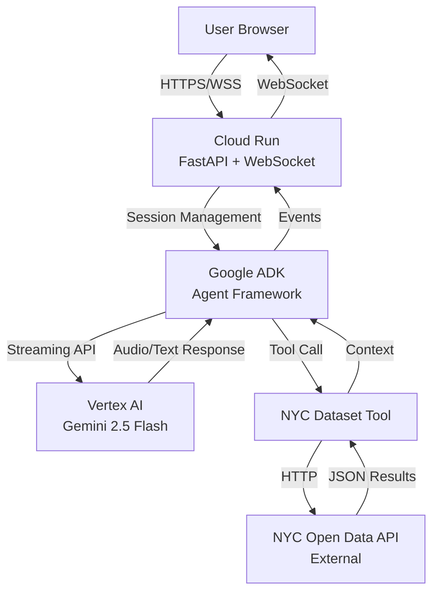
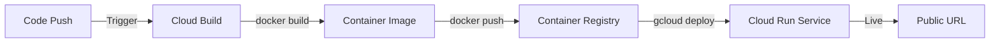
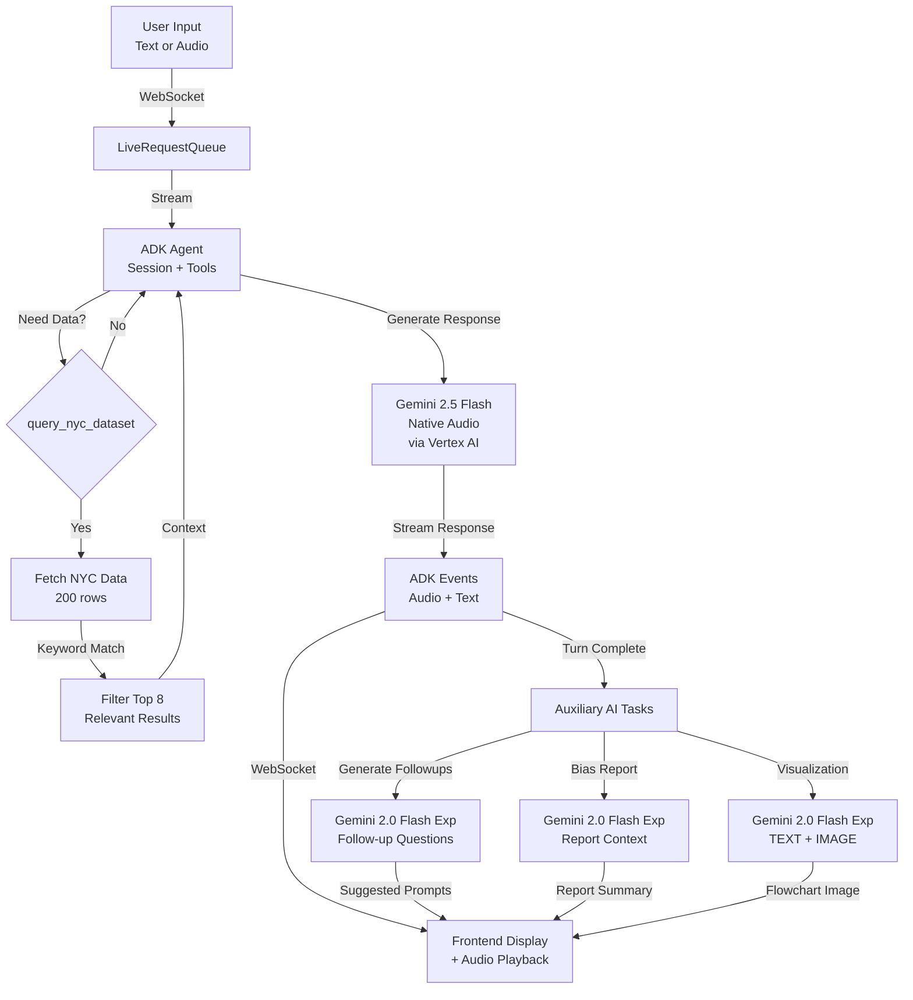

# Google Solutions Overview

This app runs entirely on Google Cloud Platform. Here's what each service does and why we use it.

## Services at a Glance

| Service | Purpose | Why We Use It |
|---------|---------|---------------|
| **Gemini 2.5 Flash Native Audio** | Main AI model with native audio I/O | Sub-500ms voice responses, no transcription latency |
| **Gemini 2.0 Flash Exp** | Auxiliary AI for text tasks | Fast generation for bias reports, follow-ups, visualizations |
| **Vertex AI** | Managed AI platform | Production-grade serving, authentication, monitoring |
| **Google ADK** | Agent framework | Handles sessions, tools, streaming without custom code |
| **Cloud Run** | Container hosting | Auto-scales, supports WebSockets, pay-per-use |
| **Cloud Build** | CI/CD pipeline | Automated builds and deploys from git |
| **Container Registry** | Docker image storage | Stores versioned images for deployment |

## Full System Architecture



## Deployment Pipeline



**Flow:**
1. Push code to repository
2. Cloud Build automatically builds Docker image
3. Image stored in Container Registry with version tags
4. Cloud Run deploys new revision and switches traffic
5. Zero downtime deployment

## AI Processing Flow



**Key Features:**
- Bidirectional streaming (input and output happen simultaneously)
- Native audio processing (no separate transcription step)
- Tool integration (agent queries NYC data when needed)
- Session persistence (conversation history maintained)
- Multiple Gemini models for different workloads:
  - **Main agent**: Gemini 2.5 Flash Native Audio for real-time voice conversations
  - **Auxiliary tasks**: Gemini 2.0 Flash Exp for follow-ups, bias reports, visualizations

## Service Details

### Gemini Models

We use two Gemini models optimized for different workloads:

#### Gemini 2.5 Flash Native Audio

**What it does:** Main conversational agent with native audio understanding and generation.

**Why we chose it:**
- Native audio support eliminates transcription latency (300-500ms savings)
- Sub-second response generation for typical queries
- Multi-turn conversation with context retention
- Integrated tool calling for dataset queries
- Handles bidirectional streaming (user can interrupt agent)

**How we use it:** Primary model for real-time voice conversations through ADK agent framework. Accessed via Vertex AI in production or AI Studio API for local development.

**Configuration:**
- Model ID: `gemini-2.5-flash-native-audio`
- Response modality: AUDIO (with transcription)
- Streaming mode: BIDI (bidirectional)
- Optional features: proactivity, affective dialog

#### Gemini 2.0 Flash Exp

**What it does:** Fast text generation for auxiliary AI tasks.

**Why we chose it:**
- Faster than 2.5 models for text-only workloads
- Lower latency for non-voice tasks
- Supports multimodal output (TEXT + IMAGE when enabled)
- Cost-effective for high-frequency operations

**How we use it:**
- Generate bias report summaries from conversation history
- Create dynamic follow-up questions after each turn
- Algorithm visualization with optional flowchart generation
- All tasks use async API calls via `genai.Client`

**Configuration:**
- Model ID: `gemini-2.0-flash-exp`
- Used for: bias reports, follow-ups, multimodal visualizations
- Multimodal mode: TEXT + IMAGE (when `ENABLE_IMAGE_GEN` is set)

### Vertex AI

**What it does:** Serves Gemini models with enterprise features.

**Why we chose it:**
- Service account authentication (no API keys in production)
- Built-in monitoring and logging
- IAM integration for access control
- Better rate limits and SLAs than AI Studio

**How we use it:** Cloud Run service account has `aiplatform.user` role to call Vertex AI APIs in us-central1 region.

### Google ADK

**What it does:** Framework for building AI agents with sessions, tools, and streaming.

**Why we chose it:**
- Handles WebSocket to Gemini API conversion automatically
- Built-in session management with conversation history
- Tool integration framework (our NYC dataset query tool and custom tools)
- Event serialization and error handling
- Native support for bidirectional streaming
- Audio transcription configuration for both input and output

**How we use it:**
- `Runner` orchestrates agent execution and manages lifecycle
- `LiveRequestQueue` handles bidirectional streaming between WebSocket and Gemini
- `InMemorySessionService` stores conversation state across turns
- `FunctionTool` wrapper for custom tools:
  - `query_nyc_dataset` - Fetches and filters NYC Open Data
  - `suggest_conversation_path` - Topic navigation
  - `get_algorithm_with_followups` - Detailed algorithm storytelling
  - `list_all_algorithms` - Algorithm catalog
  - `generate_algorithm_visualization` - Multimodal flowchart generation

**Version:** >= 1.20.0

**Key Features Used:**
- `RunConfig` with streaming mode, response modalities, transcription
- Session resumption for reconnecting conversations
- Proactivity and affective dialog (native audio models only)
- Tool calling with async Python functions

### Cloud Run

**What it does:** Runs our containerized FastAPI app with autoscaling.

**Why we chose it:**
- WebSocket support for real-time voice streaming
- Scales to zero (no cost when idle)
- Scales up automatically under load (up to 10 instances)
- Managed SSL/HTTPS, load balancing, and networking

**How we use it:** 2 vCPU, 2GB RAM per instance, 1-hour timeout for long voice sessions, unauthenticated public access.

### Cloud Build

**What it does:** Builds Docker images and deploys to Cloud Run automatically.

**Why we chose it:**
- Integrated with Container Registry and Cloud Run
- Declarative config in `cloudbuild.yaml`
- Can trigger on git push for automated deployments
- No separate CI/CD service needed

**How we use it:** Three steps: build image, push to registry, deploy to Cloud Run with environment variables.

### Container Registry

**What it does:** Stores versioned Docker images.

**Why we chose it:**
- Native GCP integration (no external registry)
- Automatic image tagging (build ID and `latest`)
- IAM-controlled access
- Used by Cloud Build and Cloud Run seamlessly

**How we use it:** Images stored at `gcr.io/PROJECT_ID/algorithm-explained` with build ID and `latest` tags.

## Environment Configuration

The application supports two deployment modes with different Google AI authentication:

### Local Development (AI Studio API)

**Configuration:**
```bash
GOOGLE_API_KEY=your_api_key_here
GOOGLE_GENAI_USE_VERTEXAI=FALSE
DEMO_AGENT_MODEL=gemini-2.5-flash-native-audio
```

**What it does:**
- Uses AI Studio API with API key authentication
- Simpler setup for local testing
- Same model capabilities as production
- No GCP project required

**Best for:** Local development, testing, quick prototyping

### Production (Vertex AI)

**Configuration:**
```bash
GOOGLE_GENAI_USE_VERTEXAI=TRUE
GOOGLE_CLOUD_PROJECT=your-project-id
GOOGLE_CLOUD_LOCATION=us-central1
DEMO_AGENT_MODEL=gemini-2.5-flash-native-audio
```

**What it does:**
- Uses Vertex AI with service account authentication
- IAM-based access control (no API keys in code)
- Built-in monitoring and logging via Cloud Logging
- Better rate limits and SLAs
- Production-grade security

**Service Account:**
- Name: `algorithm-explained-sa@PROJECT_ID.iam.gserviceaccount.com`
- Required role: `roles/aiplatform.user`
- Automatically configured via Cloud Run metadata server

**Best for:** Production deployment, team environments, regulated workloads

### Model Selection

Both modes support the same models:
- **Main agent**: `gemini-2.5-flash-native-audio` (voice conversations)
- **Auxiliary tasks**: `gemini-2.0-flash-exp` (hardcoded for text generation)

The `DEMO_AGENT_MODEL` environment variable controls only the main agent model.

## Cost Structure

**Monthly estimate for typical demo usage** (100 sessions/day, 5 min avg):

| Service | Cost |
|---------|------|
| Cloud Run compute | $5-10 |
| Vertex AI calls | $10-20 |
| Container Registry storage | $0.50 |
| Cloud Build minutes | Free tier |
| Networking | $1 |
| **Total** | **$20-35/month** |

**Production with 1 min instance:** $50-70/month

## Why Google Cloud?

**Single platform integration:** All services work together without custom glue code.

**Pay-per-use model:** Costs scale with actual usage, not reserved capacity.

**Native AI support:** Vertex AI and ADK are built specifically for Gemini models.

**WebSocket reliability:** Cloud Run handles long-lived connections well (1-hour timeout).

**Zero-config auth:** Service accounts eliminate API key management in production.

## See Also

- [DEPLOYMENT.md](DEPLOYMENT.md) - Step-by-step deployment instructions
- [REFERENCE.md](REFERENCE.md) - Technical architecture and API details
- [QUICKSTART.md](QUICKSTART.md) - Local development setup
