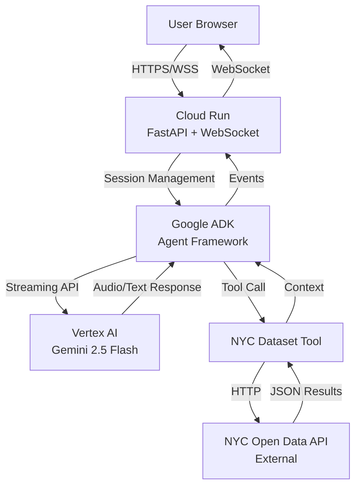
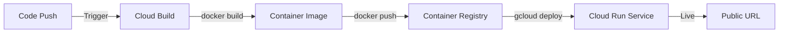
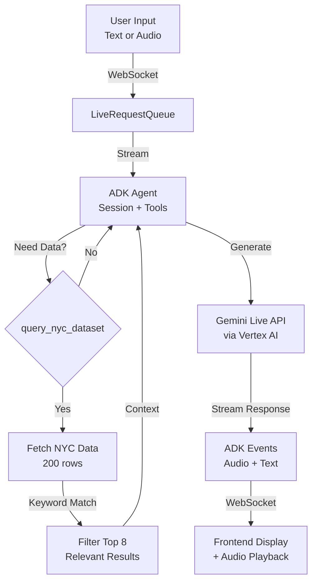

# Google Solutions Overview

This app runs entirely on Google Cloud Platform. Here's what each service does and why we use it.

## Services at a Glance

| Service | Purpose | Why We Use It |
|---------|---------|---------------|
| **Gemini 2.5 Flash** | AI model with native audio | Sub-500ms voice responses, understands speech without transcription |
| **Vertex AI** | Managed AI platform | Production-grade serving, authentication, monitoring |
| **Google ADK** | Agent framework | Handles sessions, tools, streaming without custom code |
| **Cloud Run** | Container hosting | Auto-scales, supports WebSockets, pay-per-use |
| **Cloud Build** | CI/CD pipeline | Automated builds and deploys from git |
| **Container Registry** | Docker image storage | Stores versioned images for deployment |

## Full System Architecture

## Deployment Pipeline

**Flow:**
1. Push code to repository
2. Cloud Build automatically builds Docker image
3. Image stored in Container Registry with version tags
4. Cloud Run deploys new revision and switches traffic
5. Zero downtime deployment

## AI Processing Flow

**Key Features:**
- Bidirectional streaming (input and output happen simultaneously)
- Native audio processing (no separate transcription step)
- Tool integration (agent queries NYC data when needed)
- Session persistence (conversation history maintained)

## Service Details

### Gemini 2.5 Flash

**What it does:** Processes voice and text conversations with native audio understanding.

**Why we chose it:**
- Native audio support eliminates transcription latency (300-500ms savings)
- Fast response generation (sub-second for typical queries)
- Multi-turn conversation with context retention
- Integrated tool calling for dataset queries

**How we use it:** Through Vertex AI in production (better auth, monitoring) or AI Studio API for local development.

### Vertex AI

**What it does:** Serves Gemini models with enterprise features.

**Why we chose it:**
- Service account authentication (no API keys in production)
- Built-in monitoring and logging
- IAM integration for access control
- Better rate limits and SLAs than AI Studio

**How we use it:** Cloud Run service account has `aiplatform.user` role to call Vertex AI APIs in us-central1 region.

### Google ADK

**What it does:** Framework for building AI agents with sessions, tools, and streaming.

**Why we chose it:**
- Handles WebSocket ↔ Gemini API conversion automatically
- Built-in session management with conversation history
- Tool integration (our NYC dataset query tool)
- Event serialization and error handling

**How we use it:** `Runner` orchestrates agent execution, `LiveRequestQueue` handles bidirectional streaming, `InMemorySessionService` stores conversation state.

### Cloud Run

**What it does:** Runs our containerized FastAPI app with autoscaling.

**Why we chose it:**
- WebSocket support for real-time voice streaming
- Scales to zero (no cost when idle)
- Scales up automatically under load (up to 10 instances)
- Managed SSL/HTTPS, load balancing, and networking

**How we use it:** 2 vCPU, 2GB RAM per instance, 1-hour timeout for long voice sessions, unauthenticated public access.

### Cloud Build

**What it does:** Builds Docker images and deploys to Cloud Run automatically.

**Why we chose it:**
- Integrated with Container Registry and Cloud Run
- Declarative config in `cloudbuild.yaml`
- Can trigger on git push for automated deployments
- No separate CI/CD service needed

**How we use it:** Three steps: build image, push to registry, deploy to Cloud Run with environment variables.

### Container Registry

**What it does:** Stores versioned Docker images.

**Why we chose it:**
- Native GCP integration (no external registry)
- Automatic image tagging (build ID and `latest`)
- IAM-controlled access
- Used by Cloud Build and Cloud Run seamlessly

**How we use it:** Images stored at `gcr.io/PROJECT_ID/algorithm-explained` with build ID and `latest` tags.

## Cost Structure

**Monthly estimate for typical demo usage** (100 sessions/day, 5 min avg):

| Service | Cost |
|---------|------|
| Cloud Run compute | $5-10 |
| Vertex AI calls | $10-20 |
| Container Registry storage | $0.50 |
| Cloud Build minutes | Free tier |
| Networking | $1 |
| **Total** | **$20-35/month** |

**Production with 1 min instance:** $50-70/month

## Why Google Cloud?

**Single platform integration:** All services work together without custom glue code.

**Pay-per-use model:** Costs scale with actual usage, not reserved capacity.

**Native AI support:** Vertex AI and ADK are built specifically for Gemini models.

**WebSocket reliability:** Cloud Run handles long-lived connections well (1-hour timeout).

**Zero-config auth:** Service accounts eliminate API key management in production.

## See Also

- [DEPLOYMENT.md](DEPLOYMENT.md) - Step-by-step deployment instructions
- [REFERENCE.md](REFERENCE.md) - Technical architecture and API details
- [QUICKSTART.md](QUICKSTART.md) - Local development setup
