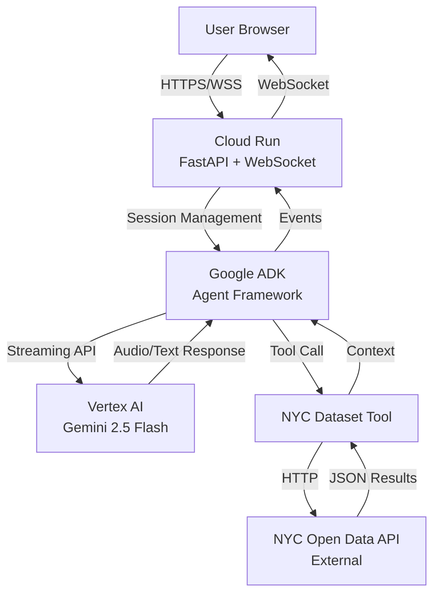
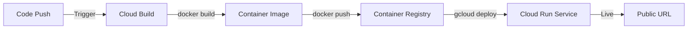

# Google Solutions Overview

This app runs entirely on Google Cloud Platform. Here's what each service does and why we use it.

## Services at a Glance

| Service | Purpose | Why We Use It |
|---------|---------|---------------|
| **Gemini 2.5 Flash Native Audio** | Main AI model with native audio I/O | Sub-500ms voice responses, no transcription latency |
| **Gemini 2.0 Flash Exp** | Auxiliary AI for text tasks | Fast generation for bias reports, follow-ups, visualizations |
| **Vertex AI** | Managed AI platform | Production-grade serving, authentication, monitoring |
| **Google ADK** | Agent framework | Handles sessions, tools, streaming without custom code |
| **Cloud Run** | Container hosting | Auto-scales, supports WebSockets, pay-per-use |
| **Cloud Build** | CI/CD pipeline | Automated builds and deploys from git |
| **Container Registry** | Docker image storage | Stores versioned images for deployment |
| **Cloud Logging** | Log aggregation | Structured logging for production monitoring |

## Full System Architecture



## Deployment Pipeline



**Flow:**
1. Push code to repository
2. Cloud Build automatically builds Docker image
3. Image stored in Container Registry with version tags
4. Cloud Run deploys new revision and switches traffic
5. Zero downtime deployment

## Service Details

### Gemini Models (Google AI)

We use two Gemini models optimized for different workloads:

#### Gemini 2.5 Flash Native Audio

**What it does:** Main conversational agent with native audio understanding and generation.

**Why we chose it:**
- Native audio support eliminates transcription latency (300-500ms savings)
- Sub-second response generation for typical queries
- Multi-turn conversation with context retention
- Integrated tool calling for dataset queries
- Handles bidirectional streaming (user can interrupt agent)
- Native multilingual support (English, Spanish, Chinese with no additional configuration)

**How we use it:** Primary model for real-time voice conversations through ADK agent framework. Accessed via Vertex AI in production or AI Studio API for local development.

**Configuration:**
- Model ID: `gemini-2.5-flash-native-audio`
- Response modality: AUDIO (with transcription)
- Streaming mode: BIDI (bidirectional)
- Optional features: proactivity, affective dialog

**Alternatives considered:**
- OpenAI Realtime API: Similar latency but less integrated with GCP tooling
- Azure Speech + GPT-4: Required separate transcription service, higher latency
- Anthropic Claude: No native audio support

#### Gemini 2.0 Flash Exp

**What it does:** Fast text and multimodal generation for auxiliary AI tasks.

**Why we chose it:**
- Faster than 2.5 models for text-only workloads
- Lower latency for non-voice tasks
- Supports multimodal output (TEXT + IMAGE when enabled)
- Cost-effective for high-frequency operations
- Optimized for speed over conversational depth

**How we use it:**
- Generate bias report summaries from conversation history
- Algorithm visualization with optional flowchart generation
- Both use async API calls via `genai.Client`
- Hardcoded as `gemini-2.0-flash-exp` for consistency

**Configuration:**
- Model ID: `gemini-2.0-flash-exp` (hardcoded)
- Used for: bias reports, multimodal visualizations
- Multimodal mode: TEXT + IMAGE (when `ENABLE_IMAGE_GEN=TRUE`)

**Note:** Follow-up question generation uses the configurable `TEXT_MODEL` environment variable (defaults to `gemini-2.5-flash`), not this model.

**Alternatives considered:**
- Claude 3.5 Sonnet: Higher quality but slower and no multimodal output
- GPT-4o-mini: Similar speed but less integrated with GCP

### Vertex AI (Google Cloud)

**What it does:** Serves Gemini models with enterprise features.

**Why we chose it:**
- Service account authentication (no API keys in production)
- Built-in monitoring and logging
- IAM integration for access control
- Better rate limits and SLAs than AI Studio
- Native integration with Cloud Run and Cloud Logging

**How we use it:** Cloud Run service account has `aiplatform.user` role to call Vertex AI APIs in us-central1 region.

**Configuration:**
- Region: `us-central1` (closest to Gemini API endpoints)
- Authentication: Service account or VERTEX_API_KEY
- Project: Set via `GOOGLE_CLOUD_PROJECT` environment variable

**Alternatives considered:**
- AI Studio API: Simpler but requires API keys, no IAM integration
- Self-hosted models: Far more expensive and complex to maintain
- Other cloud providers: Less integrated AI platform support

### Google ADK (Google Framework)

**What it does:** Framework for building AI agents with sessions, tools, and streaming.

**Why we chose it:**
- Handles WebSocket to Gemini API conversion automatically
- Built-in session management with conversation history
- Tool integration framework (FunctionTool wrapper for custom Python functions)
- Event serialization and error handling
- Native support for bidirectional streaming
- Audio transcription configuration for both input and output

**How we use it:**
- `Runner` orchestrates agent execution and manages lifecycle
- `LiveRequestQueue` handles bidirectional streaming between WebSocket and Gemini
- `InMemorySessionService` stores conversation state across turns
- `FunctionTool` wrapper for custom tools (6 tools: NYC dataset, conversation path, algorithm storytelling, list algorithms, followups, visualization)

**Version:** >= 1.20.0

**Key Features Used:**
- `RunConfig` with streaming mode, response modalities, transcription
- Session resumption for reconnecting conversations
- Proactivity and affective dialog (native audio models only)
- Tool calling with async Python functions

**Alternatives considered:**
- LangChain: More complex, less optimized for Gemini Live API
- Custom WebSocket implementation: Would require building session management, tool calling, streaming logic
- OpenAI Assistants API: Vendor lock-in to OpenAI, no native audio streaming

### Cloud Run (Google Cloud)

**What it does:** Runs our containerized FastAPI app with autoscaling.

**Why we chose it:**
- WebSocket support for real-time voice streaming
- Scales to zero (no cost when idle)
- Scales up automatically under load (up to 10 instances)
- Managed SSL/HTTPS, load balancing, and networking
- 1-hour timeout supports long voice sessions
- Native integration with Vertex AI service accounts

**How we use it:** 
- Container: Python 3.13-slim with uv package manager
- Resources: 2 vCPU, 2GB RAM per instance
- Timeout: 3600s (1 hour) for long WebSocket sessions
- Autoscaling: 0 min, 10 max instances
- Auth: allow-unauthenticated (public access)
- Service account: `algorithm-explained-sa@PROJECT_ID.iam.gserviceaccount.com` with `aiplatform.user` role

**Configuration (cloudbuild.yaml):**
```yaml
--memory=2Gi
--cpu=2
--timeout=3600
--max-instances=10
--service-account=algorithm-explained-sa@PROJECT_ID.iam.gserviceaccount.com
--set-env-vars=GOOGLE_GENAI_USE_VERTEXAI=TRUE,GOOGLE_CLOUD_PROJECT=$PROJECT_ID,GOOGLE_CLOUD_LOCATION=us-central1,DEMO_AGENT_MODEL=gemini-2.5-flash-native-audio,ENABLE_IMAGE_GEN=TRUE
```

**Alternatives considered:**
- AWS Lambda: No WebSocket support for long sessions
- Google Cloud Functions: 9-minute timeout insufficient for voice conversations
- GKE (Kubernetes): Overkill for single-service deployment, higher cost
- Self-managed VMs: Manual scaling, no auto-scaling to zero

### Cloud Build (Google Cloud)

**What it does:** Builds Docker images and deploys to Cloud Run automatically.

**Why we chose it:**
- Integrated with Container Registry and Cloud Run
- Declarative config in `cloudbuild.yaml`
- Can trigger on git push for automated deployments
- No separate CI/CD service needed
- Build logs in Cloud Logging automatically

**How we use it:** Three steps: build image, push to registry, deploy to Cloud Run with environment variables.

**Production Environment Variables (set by cloudbuild.yaml):**
- `GOOGLE_GENAI_USE_VERTEXAI=TRUE`
- `GOOGLE_CLOUD_PROJECT=$PROJECT_ID`
- `GOOGLE_CLOUD_LOCATION=us-central1`
- `DEMO_AGENT_MODEL=gemini-2.5-flash-native-audio`
- `ENABLE_IMAGE_GEN=TRUE`

**Build Configuration:**
```yaml
steps:
  - name: 'gcr.io/cloud-builders/docker'
    args: ['build', '-t', 'gcr.io/$PROJECT_ID/algorithm-explained:$BUILD_ID', ...]
  - name: 'gcr.io/cloud-builders/docker'
    args: ['push', '--all-tags', 'gcr.io/$PROJECT_ID/algorithm-explained']
  - name: 'gcr.io/cloud-builders/gcloud'
    args: ['run', 'deploy', 'algorithm-explained', ...]
```

**Alternatives considered:**
- GitHub Actions: Requires external service, less integrated with GCP
- GitLab CI: Similar to GitHub Actions
- Manual gcloud commands: No automation, error-prone

### Container Registry (Google Cloud)

**What it does:** Stores versioned Docker images.

**Why we chose it:**
- Native GCP integration (no external registry)
- Automatic image tagging (build ID and `latest`)
- IAM-controlled access
- Used by Cloud Build and Cloud Run seamlessly
- No additional authentication configuration needed

**How we use it:** Images stored at `gcr.io/PROJECT_ID/algorithm-explained` with build ID and `latest` tags.

**Alternatives considered:**
- Docker Hub: External service, less integrated
- Artifact Registry: Newer but Container Registry sufficient for our needs
- GitHub Container Registry: Requires external authentication

### Cloud Logging (Google Cloud)

**What it does:** Aggregates and stores structured logs from Cloud Run.

**Why we chose it:**
- Automatic collection from Cloud Run containers
- No configuration required (stdout/stderr automatically captured)
- Search and filter with Cloud Logging query language
- Integration with Cloud Monitoring for alerts
- Retention: 30 days default (configurable up to 3650 days)

**How we use it:**
- Application logs (Python logging to stdout)
- HTTP request logs (automatic from Cloud Run)
- Bias report submissions (logged via Python logger)
- Error tracking and debugging
- Friction event logging (via Python logger)

**Log Structure:**
```json
{
  "severity": "INFO",
  "timestamp": "2026-03-28T...",
  "resource": {
    "type": "cloud_run_revision",
    "labels": {
      "service_name": "algorithm-explained",
      "location": "us-central1"
    }
  },
  "textPayload": "Log message here"
}
```

**Query Examples:**
```bash
# View recent errors
gcloud logging read "resource.type=cloud_run_revision AND severity>=ERROR" --limit=50

# View bias reports
gcloud logging read "textPayload:\"BIAS REPORT SUBMITTED\"" --limit=20

# View friction events
gcloud logging read "textPayload:\"HIGH FRICTION detected\"" --limit=50
```

**Alternatives considered:**
- External logging (Datadog, New Relic): Additional cost, external dependency
- File-based logging only: Lost on container restart, no search capability
- Cloud SQL for logs: Overkill and expensive for log data

## Environment Configuration

The application supports two deployment modes with different Google AI authentication:

### Local Development (AI Studio API)

**Configuration:**
```bash
GOOGLE_API_KEY=your_api_key_here
GOOGLE_GENAI_USE_VERTEXAI=FALSE
DEMO_AGENT_MODEL=gemini-2.5-flash-native-audio
TEXT_MODEL=gemini-2.5-flash                    # Optional: model for auxiliary tasks
ENABLE_IMAGE_GEN=TRUE                          # Optional: enable flowchart generation
```

**What it does:**
- Uses AI Studio API with API key authentication
- Simpler setup for local testing
- Same model capabilities as production
- No GCP project required

**Best for:** Local development, testing, quick prototyping

### Production (Vertex AI)

**Configuration:**
```bash
GOOGLE_GENAI_USE_VERTEXAI=TRUE
GOOGLE_CLOUD_PROJECT=your-project-id
GOOGLE_CLOUD_LOCATION=us-central1
DEMO_AGENT_MODEL=gemini-2.5-flash-native-audio
TEXT_MODEL=gemini-2.5-flash                    # Optional: defaults to gemini-2.5-flash
ENABLE_IMAGE_GEN=TRUE                          # Optional: enable flowchart generation
```

**What it does:**
- Uses Vertex AI with service account authentication (recommended)
- IAM-based access control (no API keys in code when using service accounts)
- Built-in monitoring and logging via Cloud Logging
- Better rate limits and SLAs
- Production-grade security

**Service Account:**
- Name: `algorithm-explained-sa@PROJECT_ID.iam.gserviceaccount.com`
- Required role: `roles/aiplatform.user`
- Automatically configured via Cloud Run metadata server

**Best for:** Production deployment, team environments, regulated workloads

### Model Selection

Both modes support the same models:
- **Main agent**: `gemini-2.5-flash-native-audio` (voice conversations via ADK)
- **Auxiliary text tasks**: Model specified by `TEXT_MODEL` env variable (defaults to `gemini-2.5-flash`)
  - Used for: follow-up question generation, intent classification
  - Accessed via `genai.Client`
- **Auxiliary multimodal tasks**: `gemini-2.0-flash-exp` (hardcoded)
  - Used for: bias report context generation, flowchart image generation
  - Accessed via `genai.Client` with TEXT + IMAGE modalities
  - Optimized for speed and multimodal output

The `DEMO_AGENT_MODEL` environment variable controls only the main agent model.

## Google ADK Tool Integration

**What it provides:** Framework for integrating custom Python functions as agent tools.

**How we use it:**
- `FunctionTool` wrapper converts async Python functions into agent-callable tools
- 6 custom tools integrated: NYC dataset query, conversation navigation, algorithm storytelling
- Tools called automatically by Gemini agent during conversation
- Tool responses streamed back through ADK pipeline

**Example:**
```python
from google.adk.tools import FunctionTool

async def query_nyc_dataset(question: str) -> str:
    # Fetch and filter NYC Open Data
    return context

nyc_dataset_tool = FunctionTool(query_nyc_dataset)
agent = Agent(name="civic_agent", tools=[nyc_dataset_tool], ...)
```

**Key Features:**
- Async function support
- Automatic JSON schema generation from type hints
- Error handling and retry logic
- Streaming tool responses

## Google ADK Session Management

**What it provides:** Built-in conversation history and session persistence.

**How we use it:**
- `InMemorySessionService` stores conversation state across turns
- Keyed by `app_name`, `user_id`, `session_id`
- Allows WebSocket disconnects/reconnects without losing context
- Conversation history automatically maintained by ADK

**Configuration:**
```python
from google.adk.sessions import InMemorySessionService

session_service = InMemorySessionService()
runner = Runner(app_name=APP_NAME, agent=agent, session_service=session_service)

# Get or create session
session = await session_service.get_session(
    app_name=APP_NAME, 
    user_id=user_id, 
    session_id=session_id
)
```

**Production consideration:** For multi-instance deployments, replace with Redis-backed session service (available in ADK >= 1.20.0).

**Alternatives considered:**
- Custom session storage: Would need to implement serialization, cleanup, expiration
- Database sessions: Overkill for ephemeral conversations
- JWT tokens: Doesn't solve conversation history storage

## Cost Structure

**Monthly estimate for typical demo usage** (100 sessions/day, 5 min avg):

| Service | Cost | Notes |
|---------|------|-------|
| **Cloud Run compute** | $5-10 | 2vCPU × 2GB × usage hours |
| **Vertex AI calls** | $10-20 | Gemini 2.5 Flash audio I/O |
| **Container Registry storage** | $0.50 | Image storage |
| **Cloud Build minutes** | Free tier | < 120 builds/day |
| **Cloud Logging** | $0.50-1 | 30-day retention |
| **Networking** | $1 | Egress to external APIs |
| **Total** | **$20-35/month** | |

**Production with 1 min instance:** $50-70/month (adds ~$15-20 for always-on instance)

### Cost Breakdown by Google Service

**Cloud Run:**
- Pricing: $0.00002400 per vCPU-second, $0.00000250 per GiB-second
- Typical session: 5 min × 2 vCPU × 2GB = $0.04 compute cost
- 100 sessions/day = $4/day = ~$120/month
- With scale-to-zero: Only pay for active time (~$5-10/month for demo)

**Vertex AI:**
- Gemini 2.5 Flash Native Audio: ~$0.10-0.20 per conversation
- Includes: audio input/output, transcription, tool calling
- 100 sessions/day × $0.15 avg = $15/day = ~$450/month
- With typical 5-min conversations: ~$10-20/month

**Cloud Logging:**
- First 50 GiB/month free
- Typical usage: 1-5 GiB/month (well under free tier)
- Retention costs minimal for 30-day default

## Why Google Cloud?

**Single platform integration:** All services work together without custom glue code.

**Pay-per-use model:** Costs scale with actual usage, not reserved capacity.

**Native AI support:** Vertex AI and ADK are built specifically for Gemini models.

**Native multilingual capabilities:** Gemini models handle English, Spanish, and Chinese with no additional translation APIs or configuration.

**WebSocket reliability:** Cloud Run handles long-lived connections well (1-hour timeout).

**Zero-config auth:** Service accounts eliminate API key management in production.

**Built-in observability:** Cloud Logging captures all application logs without external services.

**Rapid iteration:** Cloud Build + Cloud Run enable sub-10-minute deploy cycles from code to production.

**No vendor lock-in concerns:** 
- Standard Docker containers (portable to other platforms)
- FastAPI backend (cloud-agnostic)
- OpenAPI-compatible Gemini API (similar to other LLM APIs)
- Migration path: Switch to AI Studio API or self-hosted models if needed

## Deployment Commands

### One-Time Setup

Enable Google Cloud APIs and create service account:

```bash
# Enable APIs
gcloud services enable run.googleapis.com \
  cloudbuild.googleapis.com \
  artifactregistry.googleapis.com \
  aiplatform.googleapis.com

# Create service account
export PROJECT_ID=$(gcloud config get-value project)
export SA_NAME=algorithm-explained-sa

gcloud iam service-accounts create $SA_NAME \
  --display-name="Algorithm Explained SA"

gcloud projects add-iam-policy-binding $PROJECT_ID \
  --member="serviceAccount:$SA_NAME@$PROJECT_ID.iam.gserviceaccount.com" \
  --role="roles/aiplatform.user"

# Grant Cloud Build permissions
export PROJECT_NUMBER=$(gcloud projects describe $PROJECT_ID --format="value(projectNumber)")

gcloud projects add-iam-policy-binding $PROJECT_ID \
  --member="serviceAccount:$PROJECT_NUMBER@cloudbuild.gserviceaccount.com" \
  --role="roles/run.admin"

gcloud projects add-iam-policy-binding $PROJECT_ID \
  --member="serviceAccount:$PROJECT_NUMBER@cloudbuild.gserviceaccount.com" \
  --role="roles/iam.serviceAccountUser"
```

### Deploy

```bash
cd algorithm-explained
gcloud builds submit --config cloudbuild.yaml
```

Deploy time: 3-5 minutes

### Monitoring with Cloud Logging

```bash
# Recent logs
gcloud run services logs read algorithm-explained \
  --region=us-central1 \
  --limit=50

# Errors only
gcloud logging read "resource.type=cloud_run_revision \
  AND resource.labels.service_name=algorithm-explained \
  AND severity>=ERROR" --limit=20

# Real-time streaming
gcloud logging tail "resource.type=cloud_run_revision \
  AND resource.labels.service_name=algorithm-explained"
```

## Service Limits and Quotas

### Vertex AI

**Gemini 2.5 Flash Native Audio:**
- Rate limit: Varies by project tier (contact Google Cloud support for increases)
- Context window: 1M tokens
- Audio input: 8 hours per request
- Audio output: Unlimited streaming

**Gemini 2.0 Flash Exp:**
- Rate limit: Higher than 2.5 models
- Context window: 1M tokens
- Multimodal output: TEXT + IMAGE supported

### Cloud Run

**Per-project limits:**
- Max instances per service: 1000 (our config: 10)
- Request timeout: 3600s max (our config: 3600s)
- Memory: Up to 32GiB (our config: 2GiB)
- CPU: Up to 8 vCPU (our config: 2)

**WebSocket limits:**
- Connection duration: Up to timeout value (3600s)
- Message size: 32MB per WebSocket message
- Concurrent connections: Limited by instance count × resources

### Cloud Build

**Free tier:**
- 120 build-minutes/day
- 10 concurrent builds
- Our builds: ~3-5 minutes each

**Storage:**
- Build logs retained 6 months
- Build history viewable in Cloud Console

### Cloud Logging

**Free tier:**
- 50 GiB/month ingestion
- 30-day retention

**Our usage:** ~1-5 GiB/month (well under free tier)

## Production Recommendations

### Increase Reliability

**Set minimum instances to 1:**
```bash
gcloud run services update algorithm-explained \
  --region=us-central1 \
  --min-instances=1
```

**Benefit:** Eliminates cold start latency (~10-30s)
**Cost:** +$15-20/month

### Scale for Production

**Increase max instances:**
```bash
gcloud run services update algorithm-explained \
  --region=us-central1 \
  --max-instances=50
```

**When:** Expected traffic > 100 concurrent users

### Enable Cloud Monitoring Alerts

```bash
# Create alert for error rate
gcloud alpha monitoring policies create \
  --notification-channels=YOUR_CHANNEL_ID \
  --display-name="Algorithm Explained - Error Rate" \
  --condition-threshold-value=10 \
  --condition-threshold-duration=300s
```

**Monitor:**
- Error rate (target: <1%)
- Request latency (P95 < 2s)
- Memory utilization (< 80%)
- Active instance count

### Replace InMemorySessionService with Redis

**For multi-instance deployments:**

1. Create Redis instance via Google Cloud Memorystore
2. Update session service configuration in ADK
3. Sessions persist across instance restarts

**When:** Running with min-instances > 1 or max-instances > 10

## Alternatives Comparison

### Why Not AWS?

| Feature | Google Cloud | AWS |
|---------|-------------|-----|
| **Native audio AI** | Gemini 2.5 Flash Native Audio | Needs Amazon Transcribe + Bedrock (2 services) |
| **Agent framework** | Google ADK (purpose-built) | No equivalent, custom code required |
| **WebSocket hosting** | Cloud Run (1-hour timeout) | API Gateway (10 min limit) or ECS |
| **Deployment** | Cloud Build (integrated) | CodePipeline + ECR (separate services) |
| **AI authentication** | Service accounts (IAM) | IAM roles (similar) |

### Why Not Azure?

| Feature | Google Cloud | Azure |
|---------|-------------|-----|
| **Native audio AI** | Gemini 2.5 Flash Native Audio | Azure Speech + GPT-4o (2 services) |
| **Agent framework** | Google ADK | No equivalent |
| **WebSocket hosting** | Cloud Run | Azure Container Apps |
| **Deployment** | Cloud Build | Azure DevOps (separate) |
| **AI integration** | Vertex AI (native) | Azure OpenAI Service |

### Why Not Multi-Cloud?

**Avoided because:**
- Increased complexity (multiple authentication systems)
- Higher latency (cross-cloud API calls)
- More expensive (data transfer costs between clouds)
- Harder to debug (logs in multiple systems)
- No significant benefit for single-service app

## See Also

- [DEPLOYMENT.md](DEPLOYMENT.md) - Step-by-step deployment instructions
- [REFERENCE.md](REFERENCE.md) - Technical architecture and API details
- [QUICKSTART.md](QUICKSTART.md) - Local development setup
