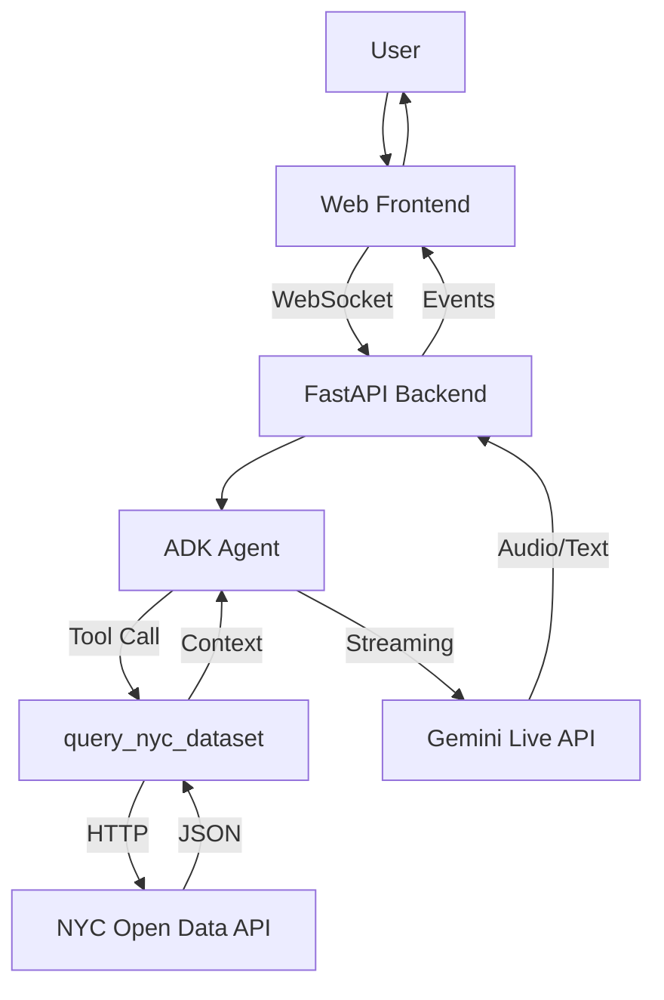

# Technical Reference

Complete technical reference for Algorithm Explained.

## System Overview

Algorithm Explained is a multimodal civic AI agent combining Google's ADK with NYC Open Data to help residents understand government algorithms through text and voice.

**Stack:**
- Frontend: Vanilla JavaScript + Web Audio API
- Backend: FastAPI + Google ADK
- AI: Gemini 2.5 Flash with native audio
- Data: NYC Open Data Socrata API

## Architecture



## Components

### Frontend

**Files:**
- `index.html` - UI structure
- `app.js` - WebSocket client and event handler
- `audio-recorder.js` - Microphone capture with PCM encoding
- `audio-player.js` - Real-time audio playback
- `pcm-recorder-processor.js` - Recording audio worklet
- `pcm-player-processor.js` - Playback audio worklet

**Responsibilities:**
- Render chat interface
- Capture text input or microphone audio
- Encode audio to 16kHz 16-bit PCM
- Stream data via WebSocket
- Receive and process ADK events
- Play back 24kHz audio responses

### Backend

**Files:**
- `main.py` - FastAPI app with WebSocket endpoint
- `civic_agent/agent.py` - ADK agent and NYC dataset tool

**ADK Components:**
- `Agent` - Configured with NYC dataset tool and civic instructions
- `Runner` - Executes agent with session management
- `SessionService` - In-memory session storage
- `LiveRequestQueue` - Thread-safe queue for streaming

**Responsibilities:**
- Accept WebSocket connections with user/session IDs
- Configure ADK RunConfig with appropriate modalities
- Route messages between client and LiveRequestQueue
- Serialize ADK events to JSON
- Handle disconnection and cleanup

### Agent

**Model:** `gemini-2.5-flash-native-audio-preview-12-2025`

**Tools:** `query_nyc_dataset` (custom NYC data retrieval)

**Behavior:**
- Queries dataset before answering
- Cites specific agencies and tools
- Explains concepts in plain language
- Admits when data is unavailable

## WebSocket API

### Endpoint

```
ws://localhost:8000/ws/{user_id}/{session_id}
wss://yourdomain.com/ws/{user_id}/{session_id}
```

**Path Parameters:**
- `user_id` - Unique user identifier
- `session_id` - Unique session identifier

Same IDs resume conversation history.

**Query Parameters:**
- `proactivity` (boolean, default: false) - Enable proactive responses
- `affective_dialog` (boolean, default: false) - Enable emotional cue detection

### Client → Server Messages

**Text:**
```json
{
  "type": "text",
  "text": "What algorithmic tools does the NYPD use?"
}
```

**Audio:** Binary WebSocket frames
- Format: PCM 16-bit signed integer
- Sample rate: 16kHz
- Channels: Mono
- Encoding: Little-endian

### Server → Client Events

All events are JSON-encoded ADK `Event` objects.

**Content Event (Text):**
```json
{
  "content": {
    "parts": [{"text": "Based on the NYC compliance data..."}]
  },
  "partial": true
}
```

**Content Event (Audio):**
```json
{
  "content": {
    "parts": [{
      "inlineData": {
        "mimeType": "audio/pcm;rate=24000",
        "data": "base64_encoded_audio..."
      }
    }]
  }
}
```

Audio is base64-encoded 24kHz PCM.

**Input Transcription:**
```json
{
  "inputTranscription": {
    "text": "What tools does the NYPD use?",
    "finished": true
  }
}
```

**Output Transcription:**
```json
{
  "outputTranscription": {
    "text": "Based on the NYC compliance data",
    "finished": false
  }
}
```

**Turn Complete:**
```json
{
  "turnComplete": true
}
```

**Interrupted:**
```json
{
  "interrupted": true
}
```

## NYC Dataset Tool

### Function

```python
async def query_nyc_dataset(question: str) -> str:
    """Query the NYC Algorithmic Tools Compliance Report dataset.
    
    Args:
        question: Natural language question about NYC algorithms
        
    Returns:
        Formatted context with relevant rows
    """
```

### Data Source

**Dataset:** [NYC Algorithmic Tools Compliance Report](https://data.cityofnewyork.us/City-Government/Algorithmic-Tools-Compliance-Report/jaw4-yuem)

**Endpoint:** `https://data.cityofnewyork.us/resource/jaw4-yuem.json`

**Update Frequency:** Quarterly (as agencies file reports)

**Row Schema:**
```json
{
  "agency_name": "New York City Police Department",
  "tool_name": "Domain Awareness System",
  "tool_description": "Real-time crime analysis platform",
  "tool_purpose": "Enhance situational awareness",
  "tool_status": "In Use"
}
```

### Retrieval Process

1. **Fetch 200 rows** from NYC Open Data API
2. **Extract keywords** from question (remove stopwords)
3. **Score each row** by keyword overlap in all fields
4. **Apply domain boosts:**
   - `nypd`: +3
   - `police`, `housing`, `education`: +2
   - `tool`, `algorithm`, `ai`: +1
5. **Return top 8 matches** with formatted context

### Performance

- Fetch time: ~500ms for 200 rows
- Scoring time: ~50ms
- Total latency: ~600ms
- Complexity: O(n × m) where n = rows, m = keywords

### Example

**Question:** "Does the NYPD use facial recognition?"

**Keywords:** `["nypd", "facial", "recognition"]`

**Scoring:**
- Row with "NYPD Facial Recognition System": 3 keyword matches + 3 boost = 6
- Row with "NYPD Domain Awareness": 1 keyword match + 3 boost = 4

**Result:** Facial Recognition row ranks first.

## Audio Pipeline

### Recording (Microphone → Server)

```
Microphone
  ↓ MediaStream
AudioContext (16kHz resample)
  ↓ AudioWorklet
Float32Array samples
  ↓ Convert to Int16
ArrayBuffer
  ↓ WebSocket binary frame
Backend (bytes)
  ↓ types.Blob
LiveRequestQueue
  ↓ Streaming
Gemini Live API
```

### Playback (Server → Speaker)

```
Gemini Live API
  ↓ ADK Event
Base64-encoded PCM
  ↓ WebSocket JSON
Frontend decode
  ↓ Int16Array
AudioWorklet ring buffer
  ↓ Float32Array
AudioContext destination
  ↓ Audio output
Speaker
```

**Ring Buffer:** 180 seconds capacity at 24kHz

## Configuration

### Environment Variables

```bash
# Required
GOOGLE_API_KEY=your_key                    # Or use Vertex AI

# Optional
DEMO_AGENT_MODEL=gemini-2.5-flash-native-audio-preview-12-2025
DATASET_URL=https://data.cityofnewyork.us/resource/jaw4-yuem.json

# Vertex AI (production)
GOOGLE_GENAI_USE_VERTEXAI=TRUE
GOOGLE_CLOUD_PROJECT=your-project-id
GOOGLE_CLOUD_LOCATION=us-central1
```

### Response Modality

Automatically detected from model:
- Native audio models (`*native-audio*`): AUDIO with transcription
- Other models: TEXT only (faster for text mode)

### Session Management

- **Storage:** In-memory (cleared on restart)
- **Resume:** Same user_id + session_id resumes conversation
- **Multi-user:** Each user_id has independent state

## Data Flow

### Text Request

```
User types → WebSocket text message → LiveRequestQueue
→ Agent receives → query_nyc_dataset(question)
→ Dataset API fetch → Score and filter rows
→ Return top 8 → Agent generates answer
→ Stream text chunks → WebSocket → Display
```

### Voice Request

```
User speaks → Microphone → AudioWorklet (16kHz PCM)
→ WebSocket binary → LiveRequestQueue → Gemini Live API
→ Input transcription event → Display user words
→ Tool call (query_nyc_dataset) → Dataset fetch
→ Tool response → Gemini generates audio (24kHz PCM)
→ Audio + output transcription events → WebSocket
→ AudioWorklet playback → Speaker
```

## Performance

### Latency Targets

| Mode | Target | Acceptable |
|------|--------|------------|
| Text response | 1-3s | < 5s |
| Voice end-to-end | 500-1500ms | < 2s |
| Dataset query | ~600ms | < 1s |
| Audio transcription | 200-500ms | < 1s |

### Scalability

- **Session storage:** In-memory (single instance)
- **WebSocket:** One connection per active user
- **Gemini API:** Rate limits depend on tier
- **Production:** Add Redis for sessions, load balancer for horizontal scaling

## Error Handling

### Frontend

- Microphone denied: Show message, fallback to text
- WebSocket disconnect: Auto-reconnect after 5s
- Audio worklet failure: Degrade to text mode

### Backend

- Dataset API failure: Return error to agent
- Session not found: Create new session
- Invalid audio: Log error, continue processing

## Health Check

```bash
curl http://localhost:8000/health
```

Response:
```json
{"ok": true}
```

## Rate Limits

**NYC Open Data (Socrata):**
- Without app token: 1,000 requests/hour
- With app token: 10,000 requests/hour

**Current implementation:** No rate limiting. Add Redis-based limiter for production.

## Browser Compatibility

**Fully supported:**
- Chrome 90+
- Edge 90+
- Safari 14+

**Limited support:**
- Firefox 88+ (Web Audio API limitations)

**Not supported:**
- Internet Explorer
- Chrome iOS (WebRTC limitations)
